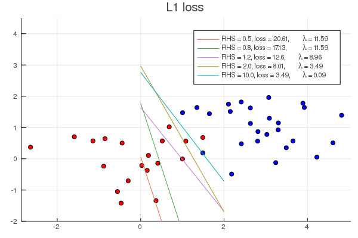
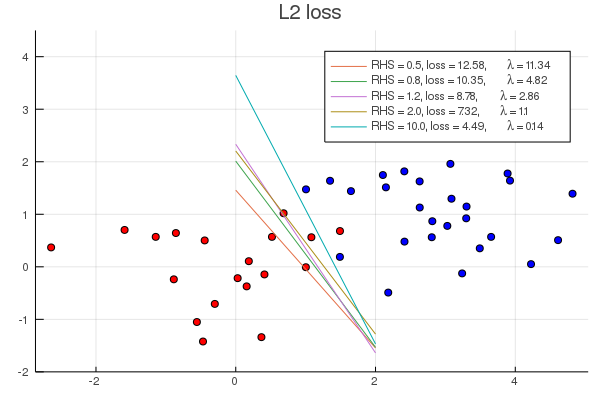

# SimpleSVMs

[](https://travis-ci.org/matbesancon/SimpleSVMs.jl)

> We should have a JuMP-based SVM.

[oxinabox](https://github.com/oxinabox)  

Implements simple Support Vector Machines using JuMP, with both L1 and L2
regularization. Since the λ parameter really is just a Lagrange multiplier,
penalties are implemented as constraints directly.

## Example

```julia
import Random
import SimpleSVMs
import Plots
using JuMP
import Clp

Random.seed!(42)
X = vcat(randn(20, 2), randn(30,2) .+ [3.0,1.5]')
y = append!(ones(20), -ones(30))

p = Plots.scatter(X[:,1], X[:,2], color = [yi > 0 ? :red : :blue for yi in y], label = "")
Plots.yaxis!(p, (-2, 4.5))
for rhs in [0.5, 0.8, 1.2, 2.0, 10.0]
   global X, y
   (m, w, b, penalty_cons) = SimpleSVMs.build_svm(SimpleSVMs.L1Penalty(rhs), X, y, with_optimizer(Clp.Optimizer, LogLevel = 0))
   optimize!(m)
   loss = JuMP.objective_value(m)
   λ = -JuMP.dual(penalty_cons)
   wv = JuMP.value.(w)
   bv = JuMP.value(b)
   @info "$wv $bv"
   Plots.plot!(p, [0.0, 2.0], [-bv / wv[2], (-bv - 2wv[1])/wv[2]], label = "RHS = $(rhs), loss = $(round(loss, digits=2)), \\lambda = $(round(λ, digits=2))")
end
Plots.title!(p, "L1 loss")
Plots.savefig("example_l1.png")

import Ipopt

p = Plots.scatter(X[:,1], X[:,2], color = [yi > 0 ? :red : :blue for yi in y], label = "")
Plots.yaxis!(p, (-2, 4.5))
for rhs in [0.5, 0.8, 1.2, 2.0, 10.0]
   global X, y
   (m, w, b, penalty_cons) = SimpleSVMs.build_svm(SimpleSVMs.L2Penalty(rhs), X, y, with_optimizer(Ipopt.Optimizer))
   optimize!(m)
   loss = JuMP.objective_value(m)
   λ = -JuMP.dual(penalty_cons)
   wv = JuMP.value.(w)
   bv = JuMP.value(b)
   @info "$wv $bv"
   Plots.plot!(p, [0.0, 2.0], [-bv / wv[2], (-bv - 2wv[1])/wv[2]], label = "RHS = $(rhs), loss = $(round(loss, digits=2)), \\lambda = $(round(λ, digits=2))")
end
Plots.title!(p, "L2 loss")
Plots.savefig("example_l2.png")
```



